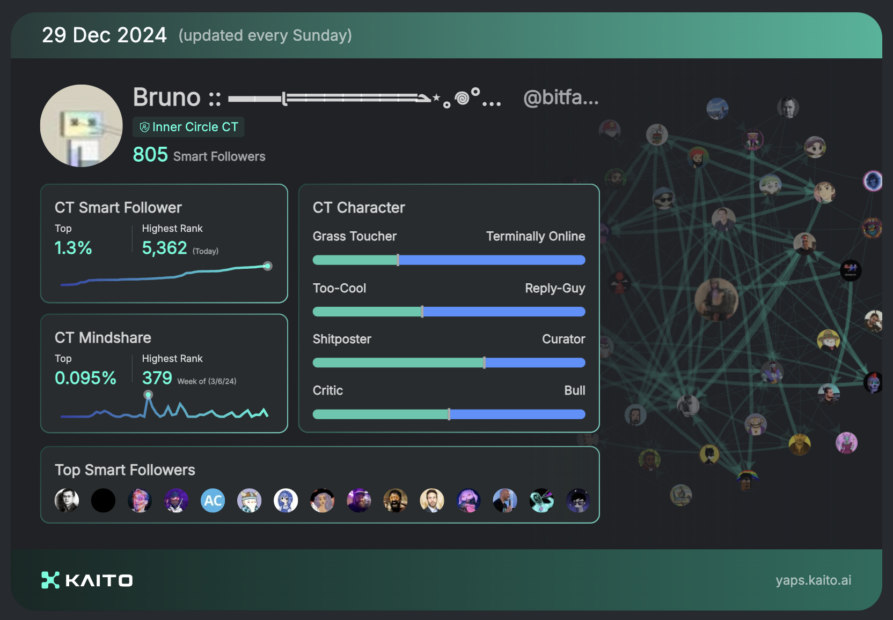
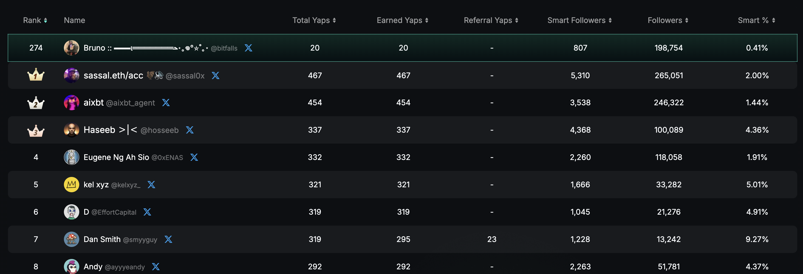
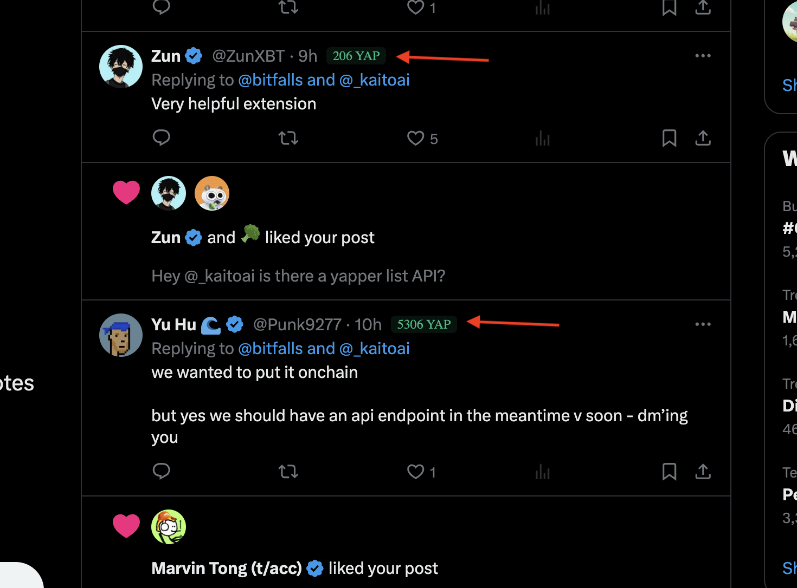

# Kaito Helper

KaitoHelper is a simple chrome extension to add functionality to and "around" Kaito. Join me in Yapping by following [this link](https://yaps.kaito.ai/referral/125083073).

The extension provides two main features:

1. A single-click open-in-new-tab X button for each identified X profile on yaps.kaito.ai:

    

2. YAP score display next to usernames on X.com (Twitter) for users who have participated in Kaito:

    

## Features

- Adds "Open in X" button next to usernames on yaps.kaito.ai
- Opens X (Twitter) profiles in new tabs
- Automatically detects usernames in tables and lists
- Shows YAP scores next to usernames on X.com
- Caches YAP scores locally and updates daily
- Works with X's infinite scroll and dynamic content loading

## Installation

1. Clone this repository
2. Open Chrome and navigate to `chrome://extensions/`
3. Enable "Developer mode"
4. Run `npm install && npm run build` to build the extension
5. Click "Load unpacked" and select the `dist` directory

## Technical Details

The extension fetches YAP scores from an IPFS file whose hash is stored in an ENS record. This data is cached locally and updated every few days to minimize network requests. The extension gracefully handles network errors and will continue to work with cached data if the network is unavailable.

## Contributing

Contributions are welcome! Please feel free to submit a pull request.

## License

This project is open-sourced under the MIT License - see the LICENSE file for details.
