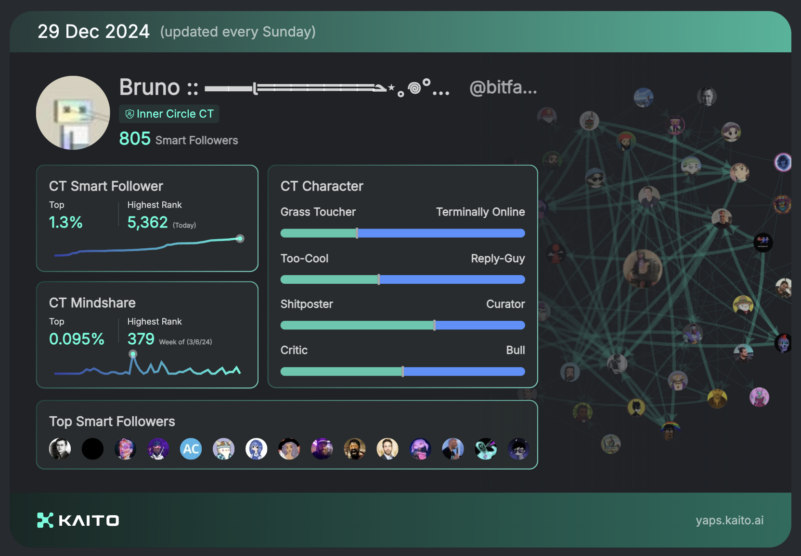
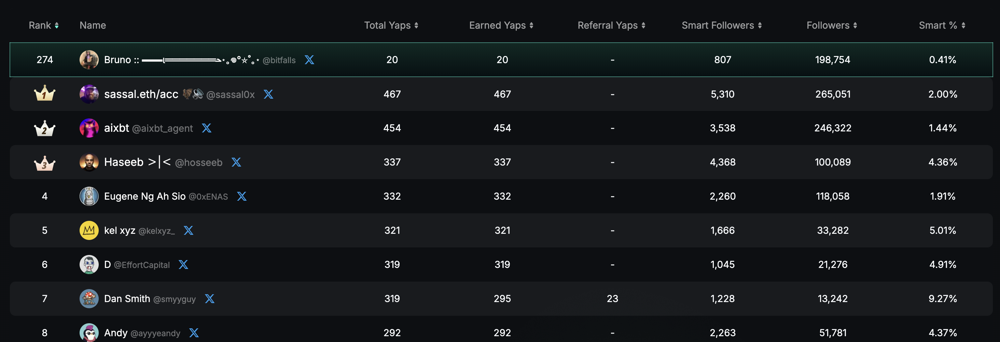

# Kaito Helper

KaitoHelper is a simple chrome extension to add functionality to Kaito. Join me in Yapping by following [this link](https://yaps.kaito.ai/referral/125083073).

The first function it provides is a single-click open-in-new-tab X button for each identified X profile on a page.

## Features

- Adds "Open in X" button next to usernames on yaps.kaito.ai
- Opens X (Twitter) profiles in new tabs
- Automatically detects usernames in tables and lists

## Installation

1. Clone this repository
2. Open Chrome and navigate to `chrome://extensions/`
3. Enable "Developer mode"
4. Click "Load unpacked" and select the extension directory

## Contributing

Contributions are welcome! Please feel free to submit a pull request.

## License

This project is open-sourced under the MIT License - see the LICENSE file for details.